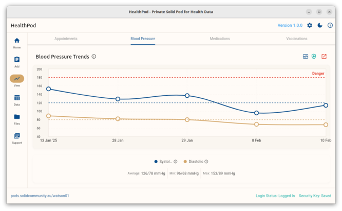
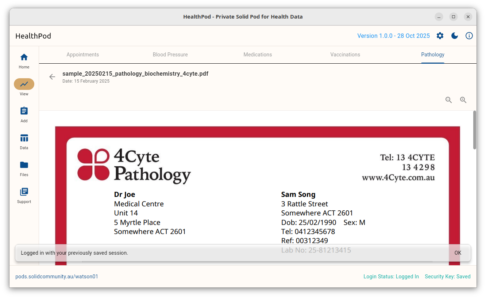

# Health Pod &mdash; Your Health Data in your Data Vault

A [solidui](https://github.com/anusii/solidui) based app to support
the secure and private storage and AI analysis of your health data with data encrypted
and stored on your own personal online data store (Pod) hosted in your
Data Vault on a Solid Server. The app was developed by the [ANU
Software Innovation Institute](https://sii.anu.edu.au) and written by
[Ashley Tang](https://github.com/atangster), [Graham
Williams](https://github.com/gjwgit), [Zheyuan
Xu](https://github.com/zheyxu), [Kevin
Wang](https://github.com/junhaow1), and [Tony
Chen](https://github.com/tonypioneer).

If you appreciate the app then please show some ❤️ and star the GitHub
Repository to support the project.  You can install the app from
different repositories including
[SnapCraft](https://snapcraft.io/healthpod) for Linux.

The latest version of the app can be run online at
[healthpod.solidcommunity.au](https://healthpod.solidcommunity.au)
with no installation required, or downloaded and installed for your
platform from the [Solid Community AU](https://solidcommunity.au):

+ **Web**
  [solidcommunity](https://healthpod.solidcommunity.au/);
+ **Android**
  [apk](https://solidcommunity.au/installers/healthpod.apk);
+ **GNU/Linux**
  [snap](https://solidcommunity.au/installers/healthpod_amd64.snap) or
  [deb](https://solidcommunity.au/installers/healthpod_amd64.deb) or
  [zip](https://solidcommunity.au/installers/healthpod-linux.zip);
+ **macOS**
  [zip](https://solidcommunity.au/installers/healthpod-macos.zip);
+ **Windows**
  [zip](https://solidcommunity.au/installers/healthpod-windows.zip)
  or
  [inno](https://solidcommunity.au/installers/healthpod-windows-inno.exe).

Contributions are welcome. Visit
[github](https://github.com/anusii/healthpod) to submit an issue or,
even better, fork the repository yourself, update the code, and submit
a Pull Request. The app is implemented in
[Flutter](https://flutter.dev) using
[solidpod](https://pub.dev/packages/solidpod) for Flutter to manage
the Solid Pod interactions. Thank you.

## Introduction

The Health Pod collects into one private and secure location all of
your health data and medical records. Value is added to the data
through various provided tools, including privacy preserving large
language models. You collect your health data together and then you
can interact with it to review your health. You can also decide if you
want to share that data with anyone else, like you general
practitioner for them to provide their professional advice.

<!-- markdownlint-disable MD013 -->
For a **quick start**, first download the [sample blood pressure CSV
file](https://raw.githubusercontent.com/anusii/healthpod/refs/heads/dev/integration_test_archive/data/sample_blood_pressure.csv). Then
within the app navigate to the FILES tab, navigate to the BLOOD
PRESSURE folder, tap the IMPORT CSV button, navigate to and choose the
downloaded `sample_blood_pressure.csv`. After the import has
completed, navigate to the VIEW tab and select the BLOOD PRESSURE
option:
<!-- markdownlint-enable MD013 -->

## Milestones

+ [X] Basic Icon-Based GUI with Solid Pod login
+ [X] Profile management with personalized profile photo upload
+ [X] File browse my medical reports
+ [X] Daily entry of Blood Pressure with visualisations
+ [X] Your latest clinic data + appointments and medicines
+ [X] Important medical information, notes and numbers
+ [X] My vaccination history

## Design Goals

The app will work well on a desktop, web browser, a mobile phone or
tablet.

A grid of icons provides access to the functionality.

The grid items include:

+ Obs (A feature to record daily or regular observations like
  blood pressure, physical activity, etc)

+ Activity (A record of activities recording date, start, end, what)

+ Diary (A record of visits to doctors, dentists, pharmacy,
  vaccinations, etc. Each diary entry records: date, what, details,
  provider, professional, total, covered, cost)

+ Docs (A file browser type of thing where the user can arrange their
  PDFs into appropriate folders as they like.)

## Use Cases

+ I am visiting the doctor and I need to check when I last had a
  vaccination

+ A LLM model runs over the whole contents of the Pod to then allow me
  to interact with the data collection.

<!-- markdownlint-disable MD036 -->
*Time-stamp: <Saturday 2026-06-13 10:29:12 +1000 Graham Williams>*
<!-- markdownlint-enable MD036 -->

<!-- markdownlint-disable MD053 -->
[comment]: # (Local Variables:)
[comment]: # (time-stamp-line-limit: -8)
[comment]: # (End:)
<!-- markdownlint-enable MD053 -->
